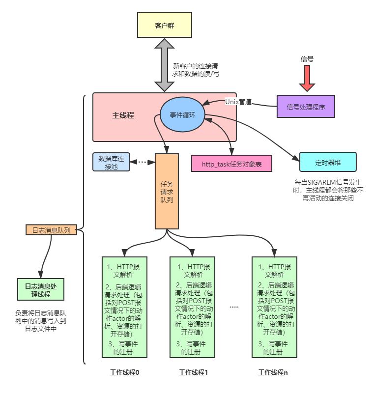

# My-TinyWebServer

## 1、项目说明

项目源自[TinyWebServer](https://github.com/qinguoyi/TinyWebServer)，并对其进行一定程度的自定义改造，最大的改变就是使用定时堆而不再是原先项目中的定时器链表，同时减少了程序的功能。整个程序完全采用半同步/半反应堆+模拟Proactor模型来构建，所有的I/O都是以边沿触发的方式运作。同时程序的启动参数仅仅支持端口号、工作线程数、数据库连接池中连接数和日志是否启动这几个选项，其他一概不支持，这样程序虽然简单但方便学习者学习，而不需要在意一些细枝末节。


## 2、服务器结构总览

### 2.1 服务器组件

整个HTTP服务器程序有如下几个最为主要的部件进行组成，并以如下面的树形图所示：

1. **线程池**：半同步/半反应堆+模拟Proactor方式运作，主线程负责事件的监听和数据的读写，而工作线程仅仅负责HTTP头部的解析和相应服务器后端逻辑的处理；
2. **数据库连接池**：在程序初始化之时创建出一些到MySQL的连接，并以链表的形式存储，在HTTP任务对象需要初始化的时候从中取得一个连接，而在工作线程处理完之后返还到链表中；
3. **逻辑处理，包括HTTP解析和后端逻辑处理**：我们把HTTP报文存储在http_task任务对象之中，以调用成员函数的方式供工作线程处理，并在处理完毕之后将得到的结果记录在http_task任务对象中，然后向epoll内核事件表注册写事件。我们可以想象实际服务器更为后端的逻辑处理应该是由一个更为“后面”的部件来完成，而不应该想这里一样由`do_request()`这样一个简单的函数来完成，这也许就是CGI最初设计的理由吧；
4. **定时器**：以定时器堆的形式组成，每隔一段时间递交一个SIGALRM信号，然后对定时器堆中绝对时间到期的定时器调用回调函数（若回调函数指针为nullptr，则表示该定时器无效，不调用），其结果就是相关长时间不再活动的连接被关闭
5. **webserver**：对程序中的部件进行整合，在程序执行之初初始化日志部件、创建数据库连接池、创建工作线程池、创建监听套接字并创建用于统一事件源的Unix管道，以之后进入事件循环；
6. **其他基础组件**：主要包括在myutils这个目录下。

```shell
    ├── http
    │   ├── http_task.cpp
    │   └── http_task.h
    ├── log
    │   ├── log.cpp
    │   ├── log.h
    │   └── log_queue.h
    ├── mysql
    │   ├── sql_connpool.cpp
    │   └── sql_connpool.h
    ├── myutils
    │   ├── myutils.cpp
    │   └── myutils.h
    ├── synchronize
    │   └── synchronize.h
    ├── threadpool
    │   └── threadpool.h
    ├── timer
    │   ├── timer_heap.cpp
    │   └── timer_heap.h
    ├── webserver
    │   ├── webserver.cpp
    │   └── webserver.h
    ├── main.cpp
    └── Makefile
```


### 2.2 服务器结构图

My-TinyWebServer服务器的网络结构图如下所示：




## 3、使用说明

在编译之前确保当前系统已经安装了必要的组件，包括：g++、make、mysql等相关的库和软件，并且要求在MySQL中创建出一个名为yourdb的数据库，并在其中创建一个具有username和passwd列的表user。在manjaro中安装mysql的步骤如下：

```shell
$> sudo pacman -S mysql
$> #安装完成后，需要进行初始化并记住临时密码
$> sudo mysqld --initialize --user=mysql --basedir=/usr --datadir=/var/lib/mysql
$> #设置开机自启
$> sudo systemctl enable mysqld.service
$> #启动mysqld
$> sudo systemctl start mysqld.service
$> #进入mysql并重新设置密码
$> mysql -u root -p
```

如果自己的用户名、数据库名和表什么的都不想是上面指定的那样，那么可以在[mian.cpp](main.cpp)文件中修改如下代码的实参：

```c++
server.init(port, "mysql用户名", "密码", "数据库名", 1, 1, sql_num, nthread, close_log);
```

完成上述的操作后，使用`make`命令就可以编译生成可执行文件server了，它仅仅支持监听端口号、工作线程数量、数据库连接池中的连接数、是否开启日志记录这些选项的设置，如下提示：

```shell
$> ./server -h
usage: server [-p port] [-n threads] [-s sql_num] [-l close_log]
```


## 4、参考文献

1. [Douglas C. Schmidt博士的主页](http://www.dre.vanderbilt.edu/~schmidt/)。道格拉斯博士就是POSA(Pattern-Oriented Software Architecture，面向模式的软件架构)的作者，我们可以在他的主页中找到下面3篇论文
2. [Reactor：一种面向同步事件的多路分解和处理器调度的对象行为模式](reference\reactor-siemens.pdf) 
3. [Proactor：一种面向异步事件的多路分解和处理器调度的对象行为模式](reference/proactor.pdf)
4. [半同步/半异步：一种高效且结构良好的I/O并发架构模式](reference\PLoP-95.pdf) ：
5. [对比两种高性能I/O设计模式](https://www.artima.com/articles/io_design_patterns.html)：这篇文章介绍了一种使用同步I/O模拟Proactor模式的方法。
6. [C10K问题](http://www.kegel.com/c10k.html#threads.nptl)

