# Proactor：一种用于异步事件的多路分解和调度处理程序的对象行为模式

现代操作系统为开发并发应用程序提供了多种机制。 同步多线程是一种流行的机制，用于开发同时执行多项操作的应用程序。 但是，线程通常具有高性能开销，并且需要对同步模式和原理有深入的了解。因此，越来越多的操作系统支持异步机制，这些机制在降低多线程的开销和复杂性的同时，提供了并发的好处。

本文介绍的Proactor模式描述了如何构建有效利用操作系统支持的异步机制的应用程序和系统。当应用程序调用异步操作时，操作系统将代表该应用程序执行该操作。这允许应用程序同时运行多个操作，而无需应用程序具有相应数量的线程。 因此，Proactor模式通过需要更少的线程并利用OS对异步操作的支持来简化并发编程并提高性能。


## 1 目的

Proactor模式支持多个事件处理程序的解复用和分派，这些事件处理程序由异步事件的完成触发。 通过集成完成事件的多路分解及其相应事件处理程序的分派，此模式简化了异步应用程序的开发。


## 2 动机

本节提供了使用Proactor模式的背景和动机。

### 2.1 上下文和强制

当应用程序要求并发执行操作的性能优势而不受同步多线程或反应式编程的约束时，应应用Proactor模式。 为了说明这些好处，请考虑需要同时执行多个操作的联网应用程序。 例如，高性能的Web服务器必须同时处理从多个客户端[1、2]发送的HTTP请求。 图1显示了Web浏览器和Web服务器之间的典型交互。
当用户指示浏览器打开URL时，浏览器将HTTP GET请求发送到Web服务器。 收到后，服务器将解析并验证请求，然后将指定的文件发送回浏览器。

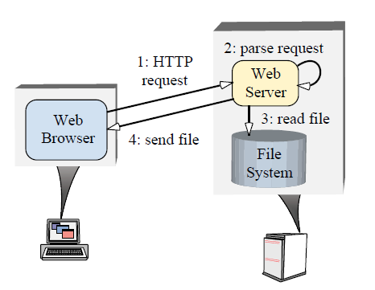

开发高性能Web服务器需要解决以下问题：

- 并发性–服务器必须同时执行多个客户端请求；
-  效率–服务器必须最小化延迟，最大化吞吐量，并避免不必要地利用CPU。
- 简化编程–服务器的设计应简化高效并发策略的使用；
-  适应性–集成新的或改进的传输协议（例如HTTP 1.1 [3]）应产生最小的维护成本。

可以使用多种并发策略来实现Web服务器，这些策略包括多个同步线程，反应式同步事件分派和主动式异步事件分派。 下面，我们检查了常规方法的弊端，并说明了Proactor模式如何提供一种强大的技术，该技术为高性能并发应用程序支持高效灵活的异步事件调度策略。


### 2.2 常规并发模型的常见陷阱和陷阱

同步多线程和反应式编程是实现并发的常见方法。 本节描述了这些编程模型的缺点。

#### 2.2.1 通过多个同步线程的并发

实现并发Web服务器的最直观的方法也许是使用同步多线程。 在此模型中，多个服务器线程同时处理来自多个客户端的HTTP GET请求。 每个线程同步执行连接建立，HTTP请求读取，请求解析和文件传输操作。 结果，每个操作都将阻塞直到完成。
同步线程的主要优点是简化了应用程序代码。 特别是，Web服务器为满足客户A的请求而执行的操作大部分独立于为客户B的请求进行服务所需的操作。 因此，由于在线程之间共享的状态量很低，因此很容易在单独的线程中为不同的请求提供服务，从而最大程度地减少了同步需求。 此外，在单独的线程中执行应用程序逻辑允许开发人员利用直观的顺序命令和阻止操作。

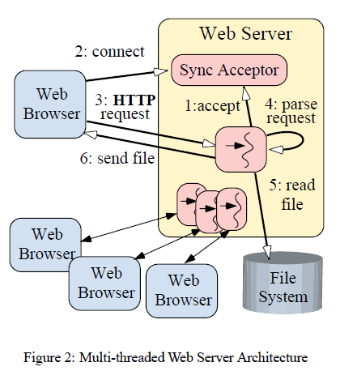

图2显示了使用同步线程设计的Web服务器如何可以同时处理多个客户端。
此图显示了一个Sync Acceptor对象，该对象封装了用于同步接受网络连接的服务器端机制。 每个线程使用“每连接线程数”并发模型为服务HTTP GET请求而执行的步骤序列可以总结如下：

1. 每个线程同步阻塞等待客户端连接请求的接受套接字调用；
2. 客户端连接到服务器，并接受连接；
3. 从网络连接中同步读取新客户端的HTTP请求；
4. 解析请求；
5. 同步读取请求的文件；
6. 文件被同步发送到客户端。

附录A.1中显示了将同步线程模型应用于Web服务器的C ++代码示例。

如上所述，每个并发连接的客户端由专用服务器线程服务。 线程在处理其他HTTP请求之前同步完成请求的操作。 因此，要在服务多个客户端的同时执行同步I / O，Web服务器必须产生多个线程。 尽管此同步多线程模型很直观，并且可以相对有效地映射到多CPU平台上，但它具有以下缺点：

线程策略与并发策略紧密耦合：此体系结构要求每个连接的客户端都有专用的线程。 通过将其线程策略调整为可用资源（例如通过线程池的CPU数量）而不是同时服务的客户端数量，可以更好地优化并发应用程序。

增加的同步复杂性：线程处理会增加同步化对服务器共享资源（例如缓存的文件和Web页面命中记录）的访问所必需的同步机制的复杂性；

 增加的性能开销：由于上下文切换，同步和CPU之间的数据移动，导致线程执行不佳[4]；

 不可移植性：线程可能并非在所有OS平台上都可用。 而且，OS平台在对抢占式和非抢占式线程的支持方面差异很大。

 因此，很难构建在整个OS平台上性能一致的多线程服务器。由于这些缺点，多线程通常不是开发并发Web服务器的最有效或最不复杂的解决方案。


#### 2.2.2 通过反应式同步事件分派进行并发

实现同步Web服务器的另一种常用方法是使用反应式事件分派模型。
Reactor模式[5]描述了应用程序如何向Initiation Dispatcher注册事件处理程序。 当可以启动操作而不阻塞时，启动调度程序会通知事件处理程序。
单线程并发Web服务器可以使用反应式事件调度模型，该模型在事件循环中等待Reactor通知其启动适当的操作。
Web服务器中的响应操作的一个示例是接受器[6]向启动分派器的注册。 当数据到达网络连接时，调度程序将回调接受器。 接受器接受网络连接并创建一个HTTP处理程序。 然后，该HTTP处理程序向Reactor注册，以在Web服务器的单个控制线程中处理该连接上的传入URL请求。

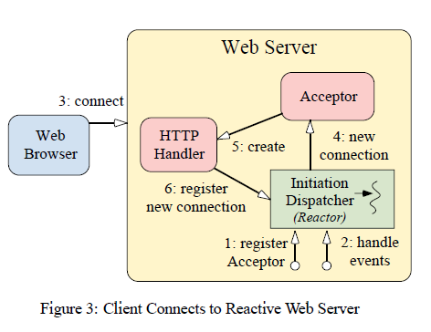

图3和图4显示了使用反应式事件分派设计的Web服务器如何处理多个客户端。 图3显示了客户端连接到Web服务器时采取的步骤。 图4显示了Web服务器如何处理客户端请求。 图3的步骤顺序可以总结如下：

1. Web服务器在启动分派器中注册一个接受器，以接受新的连接； 
2. Web服务器调用启动调度程序的事件循环；
3. 客户端连接到Web服务器；
4. 初始调度程序将新的连接请求通知接受者，并且接受者接受新的连接；
5. 接受者创建一个HTTP处理程序handler来为新客户端提供服务；
6. HTTP处理程序向Initiation Dispatcher注册该连接以读取客户端请求数据（即，当连接变为“准备读取”时）；
7. HTTP处理程序为来自新客户端的请求提供服务。

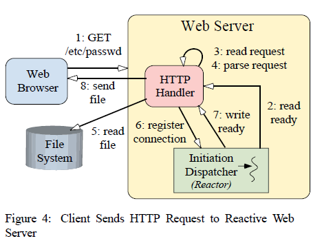

图4显示了反应式Web服务器为服务HTTP GET请求而采取的步骤序列。 该过程描述如下：

1. 客户端发送一个HTTP GET请求；
2. 当客户端请求数据到达服务器时，Initiation Dispatcher通知HTTP处理程序。
3. 以非阻塞方式读取请求，以使读取操作返回EWOULDBLOCK（如果该操作将导致调用线程阻塞）（重复执行步骤2和3，直到完全读取了请求）； 
4. HTTP处理程序解析HTTP请求；
5. 从文件系统同步读取请求的文件；
6. HTTP处理程序向启动分派器注册该连接以发送文件数据（即，当连接变为“准备写入”时）；
7. .当TCP连接准备好写入时，Initiation Dispatcher会通知HTTP处理程序；
8. HTTP处理程序以非阻塞方式将请求的文件发送到客户端，以便如果该操作会导致调用线程阻塞，则写操作将返回EWOULDBLOCK（步骤7和8将重复进行，直到数据完全传递为止）。

附录A.2中显示了将反应式事件分发模型应用于Web服务器的C ++代码示例。

由于Initiation Dispatcher在单个线程中运行，因此网络I / O操作在Reactor的控制下以非阻塞方式运行。 如果当前操作的前进进度停滞不前，则将操作移交给“启动分派器”，该启动器会监视系统操作的状态。 当操作可以再次进行前进时，将通知相应的事件处理程序。
反应模型的主要优点是可移植性，由于粗粒度并发控制（即单线程不需要同步或上下文切换）而导致的低开销，以及通过将应用程序逻辑与调度机制分离而实现的模块化。 但是，这种方法具有以下缺点：

复杂的编程：从上面的列表中可以看出，程序员必须编写复杂的逻辑以确保在服务特定客户端时服务器不会阻塞。
		缺乏对多线程的OS支持：大多数操作系统通过select系统调用[7]实现反应式调度模型。 但是，select不允许在同一描述符集的事件循环中等待多个线程。 这使得反应式模型不适用于高性能应用程序，因为它没有有效利用硬件并行性。
		可运行任务的调度：在支持抢占式线程的同步多线程体系结构中，操作系统负责将可运行线程调度和切片到可用CPU上。 由于应用程序中只有一个线程，因此此调度支持在反应式体系结构中不可用。 因此，系统开发人员必须谨慎地在连接到Web服务器的所有客户端之间共享线程。这可以通过仅执行短持续时间的非阻塞操作来实现。
由于这些缺点，当硬件并行可用时，反应式事件分发并不是最有效的模型。 由于需要避免阻塞I / O，因此该模型还具有相对较高的编程复杂度。


#### 2.3 解决方案：通过主动操作进行并发

当OS平台支持异步操作时，实现高性能Web服务器的一种高效便捷的方法是使用主动事件调度。使用主动事件分派模型设计的Web服务器使用一个或多个控制线程来处理异步操作的完成。 因此，Proactor模式通过集成完成事件多路分解和事件处理程序调度来简化异步Web服务器。

异步Web服务器将通过首先使Web服务器向OS发出异步操作，并向Completion Dispatcher注册一个回调来利用Proactor模式，该回调将在操作完成时通知Web服务器。 然后，操作系统代表Web服务器执行该操作，然后将结果排队在众所周知的位置。完成分派器负责使完成通知出队并执行包含特定于应用程序的Web服务器代码的适当回调。图5和6显示了使用主动事件分派设计的Web服务器如何在一个或多个线程中同时处理多个客户端。 图5显示了客户端连接到Web服务器时采取的步骤顺序。

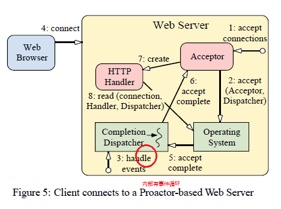

1.  Web服务器指示接受器启动异步接受；
2. 接受器与操作系统一起启动异步接受，并将其自身作为完成处理程序和对完成调度器的引用进行传递（意识说它将这个handler的引用传递给了Completion Dispatcher），该引用将在异步接受完成时用于通知接受器； 
3.  Web服务器调用完成调度程序的事件循环；
4. 客户端连接到Web服务器；
5. 异步接受操作完成后，操作系统将通知完成调度程序；
6. 完成调度员通知接受方；
7. 接受者创建一个HTTP处理程序；
8. HTTP处理程序启动异步操作以从客户端读取请求数据，并将其自身作为完成处理程序和对完成调度程序的引用进行传递（给Completion Dispatcher），该引用将在异步读取完成时用于通知HTTP处理程序。

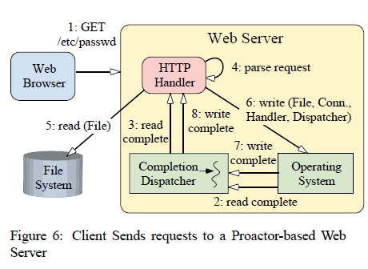

图6显示了proactiveWeb服务器为服务HTTP GET请求而采取的步骤序列。 这些步骤说明如下：

1. 客户端发送HTTP GET请求；
2. 读取操作完成，并且操作系统通知完成调度程序；
3. Completion Dispatcher通知HTTP处理程序（步骤2和3将重复进行，直到收到整个请求为止）；  
4. HTTP处理程序解析请求；
5. HTTP处理程序同步读取请求的文件；
6. HTTP处理程序启动异步操作以将文件数据写入客户端连接，并将其自身作为完成处理程序以及对完成调度程序的引用进行传递（给Completion Dispatcher），该引用将在异步写入完成时用于通知HTTP处理程序；
7. 写操作完成后，操作系统会通知完成调度程序；
8. 然后，完成调度程序通知完成处理程序（步骤6-8继续进行，直到文件已完全交付为止）。

第8节中出现了一个将主动事件分配模型应用于Web服务器的C ++代码示例。
使用Proactor模式的主要优点是，可以启动多个并发操作并可以并行运行，而不必要求应用程序具有多个线程。 这些操作由应用程序异步启动，并且在OS的I / O子系统中运行至完成。 现在，启动该操作的线程可用于服务其他请求。

例如，在上面的示例中，完成调度程序可以是单线程的。 当HTTP请求到达时，单个Completion  Dispatcher线程将解析该请求，读取文件，然后将响应发送到客户端。 由于响应是异步发送的，因此可能会同时发送多个响应。此外，*可以用异步文件读取来替换同步文件读取*，以进一步增加并发的可能性。 如果文件读取是异步执行的，则HTTP处理程序执行的唯一同步操作是HTTP协议请求解析。

主动模型的主要缺点是编程逻辑至少与反应模型一样复杂。 此外，Proactor模式可能难以调试，因为异步操作通常具有不可预测且不可重复的执行序列，这使分析和调试变得复杂。 第7节描述了如何应用其他模式（例如AsynchronousCompletion令牌[8]）来简化异步应用程序编程模型。


## 3 适用性

当满足以下一个或多个条件时，请使用Proactor模式：

1. 应用程序需要执行一个或多个异步操作而不会阻塞调用线程；
2. 异步操作完成后，必须通知应用程序。
3.  应用程序需要独立于其I / O模型来改变其并发策略； 
4. 通过将与应用程序相关的逻辑与与应用程序无关的基础架构分离，可以使应用程序受益。
5.  使用多线程方法或反应式分派方法时，应用程序的性能会很差或无法满足其性能要求。


## 4 结构和参与者

Proactor模式的结构在图7中使用OMT表示法进行了说明。

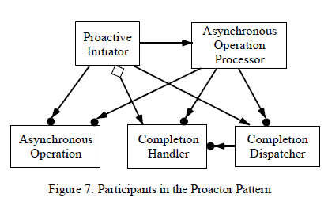

Proactor模式的主要参与者包括（高亮的部分是编程者需要关注的地方）：

==**Proactive Initiator**==（Web服务器应用程序的主线程）：

- Proactive Initiator是应用程序中任何启动异步操作的实体。 **主动启动器（Proactive Initiator）向异步操作处理器注册完成处理程序（Completion Handler）和完成调度程序（completion Dispatcher），并在操作完成时通知它。**

==**完成处理程序**==（接受器和HTTP处理程序）：

- Proactor模式使用由应用程序实现的完成处理程序接口来进行异步操作完成通知。

==**异步操作**==（异步读取，异步写入和异步接受方法）：

- 异步操作用于代表应用程序执行请求（例如I / O和计时器操作）。 当应用程序调用异步操作时，无需借用应用程序的控制线程即可执行操作。因此，从应用程序的角度来看，这些操作是异步执行的。
    异步操作完成后，异步操作处理器将应用程序通知委托给完成调度程序。

**异步操作处理器**（操作系统）：

- 异步操作由异步操作处理器运行至完成。该组件通常由OS实现。

==**完成分派器**==（通知队列）：

- 完成分派器负责在异步操作完成时回调应用程序的完成处理程序。 当异步操作处理器完成异步启动的操作时，完成调度程序将代表它执行应用程序回调。


## 5 合作

对于所有异步操作，都有几个定义明确的步骤。 在高度抽象的情况下，应用程序异步启动操作，并在操作完成时得到通知。 图8显示了模式参与者之间必须发生的以下交互：

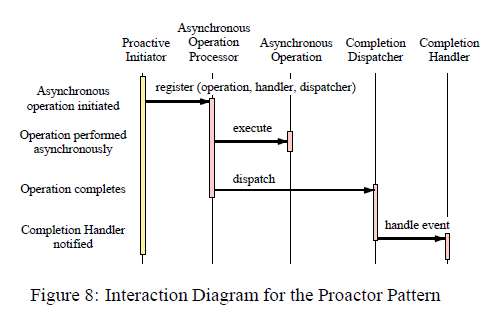

1.**主动启动器启动操作**：为了执行异步操作，应用程序在“异步操作处理器”上启动操作。例如，Web服务器可能会要求OS使用特定的套接字连接通过网络传输文件。要请求此操作，Web服务器必须指定要使用的文件和网络连接。 此外，Web服务器必须指定（1）操作完成时通知哪个完成处理程序，以及（2）文件传输后应由哪个完成调度程序执行回调。

2.**异步操作处理器执行操作**：当应用程序在异步操作处理器上调用操作时，它相对于其他应用程序操作异步运行它们。现代操作系统（例如Solaris和Windows NT）在内核内提供异步I / O子系统。

3.**异步操作处理器通知完成分派器**：操作完成后，异步操作处理器将检索启动操作时指定的完成处理程序和完成分派器。 然后，异步操作处理器将完成操作的结果传递给完成调度程序，以完成回调。 例如，如果文件是异步传输的，则异步操作处理器可以报告完成状态（例如成功或失败），以及写入网络连接的字节数。

4.**Completion Dispatcher通知应用程序**：Completion Dispatcher调用Completion Handler上的完成挂钩，并向其传递应用程序指定的任何完成数据。 例如，如果异步读取完成，则通常将向完成处理程序传递指向新到达数据的指针。


## 6 结果

本节详细介绍了使用Proactor模式的后果。

### 6.1 好处

Proactor模式具有以下好处：

**分离的关注点增多**：Proactor模式将与应用程序无关的异步机制与特定于应用程序的功能分离。 与应用程序无关的机制成为可重用的组件，这些组件知道如何对与异步操作关联的完成事件进行多路分解，并分派由“完成处理程序”定义的适当的回调方法。 同样，特定于应用程序的功能知道如何执行特定类型的服务（例如HTTP处理）。

**改进的应用程序逻辑可移植性**：通过允许其接口独立于执行事件多路分解的基础OS调用重用，可以提高应用程序的可移植性。 这些系统调用检测并报告可能在多个事件源上同时发生的事件。 事件源可能包括I / O端口，计时器，同步对象，信号等。在实时POSIX平台上，异步I / O功能由API的aio系列提供[9]。 在Windows NT中，I / O完成端口和重叠的I / O用于实现异步I / O [10]。

**完成分派器封装了并发机制**：将完成分派器与异步操作处理器解耦的一个好处是，应用程序可以使用各种并发策略配置完成分派器，而不会影响其他参与者。 如第7节所述，可以将完成调度程序配置为使用多种并发策略，包括单线程和线程池解决方案。

**线程策略与并发策略脱钩**：由于异步操作处理器代表主动发起者完成了可能长时间运行的操作，因此应用程序不会被迫产生线程以增加并发性。 这允许应用程序独立于其线程策略来更改其并发策略。 例如，一个Web服务器可能只希望每个CPU具有一个线程，但是可能希望同时为更多数量的客户端提供服务。

**性能提高**：多线程操作系统执行上下文切换，以在多个控制线程之间循环。 尽管执行上下文切换的时间保持相当恒定，但是如果OS上下文切换到空闲线程4，则通过大量线程循环的总时间可能会严重降低应用程序性能。 例如，线程可能会轮询OS以获取完成状态，这效率很低。  Proactor模式可以通过仅激活具有要处理的事件的控制逻辑线程来避免上下文切换的开销。 例如，如果没有挂起的GET请求，则Web服务器不需要激活HTTP处理程序。

**简化应用程序同步**：只要完成处理程序不产生其他控制线程，就可以在编写应用程序逻辑时很少或根本不考虑同步问题。 可以将完成处理程序编写为好像它们存在于常规单线程环境中一样。 例如，Web服务器的HTTP GET处理程序可以通过异步读取操作（例如Windows NT TransmitFile函数[1]）访问磁盘。


### 6.2 缺点

Proactor模式具有以下缺点：

**难以调试**：用Proactor模式编写的应用程序可能难以调试，因为控制反转的过程在框架基础结构和特定于应用程序的处理程序的方法回调之间振荡。 由于应用程序开发人员可能不了解或无法访问框架代码，因此这增加了在调试器中通过框架的运行时行为“单步执行”的难度。 这类似于尝试调试用LEX和YACC编写的编译器的词法分析器和解析器时遇到的问题。 在这些应用程序中，当控制线程位于用户定义的动作例程中时，调试非常简单。 但是，一旦控制线程返回到生成的确定性有限自动机（DFA）骨架，就很难遵循程序逻辑。

**计划和控制未完成的操作**：主动发起程序可能无法控制异步操作的执行顺序。 因此，必须精心设计异步操作处理器以支持优先级和取消异步操作。


## 7 实现

Proactor模式可以通过多种方式实现。本节讨论实现Proactor模式所涉及的步骤。

### 7.1 ==实现异步操作处理器==

实现Proactor模式的第一步是构建异步操作处理器。异步操作处理器负责代表应用程序异步执行操作。 结果，它的两个主要职责是导出异步操作API和实现异步操作引擎来完成工作。

#### 7.1.1 定义异步操作API

异步操作处理器必须提供一个API，允许应用程序请求异步操作。 设计这些API时，需要考虑多种因素：

**可移植性**：API不应将应用程序或其Proactve Initiator绑定到特定平台。

**灵活性**：通常，异步API可以为许多类型的操作共享。 例如，异步I / O操作通常可用于在多种介质（例如网络和文件）上执行I / O。 设计支持此类重用的API可能是有益的。

**回调**：调用操作时，主动启动器必须注册一个回调。 实现回调的一种常见方法是让调用对象（客户端）导出调用者（服务器）已知的接口。 因此，主动启动器必须在操作完成时通知异步操作处理器哪个完成处理程序应被回调。

**完成分派器**：由于应用程序可以使用多个完成分派器，因此主动启动器还必须指示哪个完成分派器应执行回调。

 考虑到所有这些问题，请考虑以下用于异步读取和写入的API。  Asynch Stream类是用于启动异步读取和写入的工厂。 构造完成后，可以使用此类启动多个异步读取和写入。 当异步读取通过完成处理程序上的句柄读取回调完成时，Asynch Stream :: Read_Result将传递回处理程序。类似地，当异步写入通过完成处理程序上的句柄写回调完成时，Asynch Stream :: Write Result将传递回处理程序。

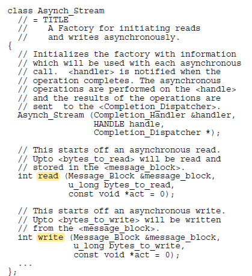


#### 7.1.2 实现异步操作引擎

异步操作处理器必须包含一种异步执行操作的机制。换句话说，当应用程序线程调用异步操作时，必须在不借用应用程序的控制线程的情况下执行该操作。 幸运的是，现代操作系统提供了用于异步操作的机制（例如POSIX异步I / O和WinNT重叠I / O）。在这种情况下，实现这部分模式仅需要将platformAPI映射到所描述的异步操作API 以上。

如果OS平台不提供对异步操作的支持，则可以使用多种实现技术来构建异步操作引擎。 也许最直观的解决方案是使用专用线程为应用程序执行异步操作。 要实现线程化异步操作引擎，需要执行三个主要步骤：

1. **操作调用**：由于操作将在与调用应用程序线程不同的控制线程中执行，因此必须发生某种类型的线程同步。 一种方法是为每个操作生成一个线程。 更为常见的方法是让异步操作处理器控制专用线程池。 这种方法将要求应用程序线程在继续其他应用程序计算之前将操作请求排队。
2. **操作执行**：由于该操作将在专用线程中执行，因此它可以执行“阻止”操作，而不会直接阻碍应用程序的进度。例如，当提供一种用于异步I / O读取的机制时，专用线程可能会在从套接字或文件句柄读取时阻塞。
3. **操作完成**：操作完成后，必须通知应用程序。 特别是，专用线程必须将特定于应用程序的通知委派给完成调度程序。 这将需要线程之间的其他同步。


### 7.2 ==实现完成分派器==

当完成分派器从异步操作处理器接收到操作完成时，将回调与应用程序对象相关联的完成处理程序。 实现Completion Dispatcher涉及两个问题：（1）实现回调和（2）定义用于执行回调的并发策略。

#### 7.2.1 实现回调

完成调度程序必须实现一种机制，通过该机制可以调用完成处理程序。这要求主动启动器在启动操作时指定回调。 以下是常见的回调替代方法：

**回调类**：完成处理程序将导出完成调度程序已知的接口。 当操作完成时，Completion Dispatcher会在此接口上回调方法，并将有关已完成操作的信息（例如，从网络连接读取的字节数）传递给该方法。

**函数指针**：Completion Dispatcher通过回调函数指针调用Completion Handler。 这种方法有效地打破了完成调度程序和完成处理程序之间的知识依赖性。 这有两个好处：

1. 不强制完成处理程序导出特定接口；
2. 在完成调度程序和完成处理程序之间不需要编译时相关性。

**集合**（意思就是说在程序中的某一个点等待异步操作的完成，若检查后发现I/O操作已经完成则由完成调度程序调用Handler上的处理操作）：主动发起程序可以建立事件对象或条件变量，用作完成调度程序和完成处理程序之间的集合。 当完成处理程序是主动启动程序时，这是最常见的。 当异步操作运行完成时，完成处理程序将处理其他活动。 完成处理程序将定期在集合点检查完成状态。


#### 7.2.2 定义完成分派器并发策略

当操作完成时，异步操作处理器将通知完成分派器。 此时，完成分配器可以利用以下并发策略之一执行应用程序回调：

**动态线程分配**：完成分配器可以为每个完成处理程序动态分配线程。 动态线程分派可以在大多数多线程操作系统中实现。在某些平台上，由于创建和销毁线程资源的开销，这可能是针对Completion Dispatcher实现列出的那些技术中效率最低的技术。

**反应后分派**：完成调度程序可以用信号通知由主动发起方建立的事件对象或条件变量。 尽管轮询并生成在事件对象上阻塞的子线程是选项，但事后响应分派的最有效方法是在Reactor中注册事件。 可以在POSIX实时环境中使用aio暂停来实现后响应调度，而在Win32环境中可以使用WaitForMultipleObjects来实现后响应调度。

**直通调度**：异步操作处理器的控制线程可以由完成调度程序借用以执行完成处理程序。 这种“周期窃取”策略可以通过减少空闲线程的发生率来提高性能。 在较旧的操作系统将上下文切换到空闲线程以切换回空闲线程的情况下，这种方法具有回收“丢失”时间的巨大潜力。可以在Windows NT中使用ReadFileEx和WriteFileEx Win32函数实现通过调用的分派。 例如，控制线程可以使用这些调用来等待信号量被发信号。 等待时，线程会通知OS进入了一种特殊状态，称为“可等待状态”。 此时，操作系统可以抓住对控制堆栈的等待线程和相关资源的控制权，以执行完成处理程序。

**线程池分派**：Completion Dispatcher拥有的线程池可用于Completion Handler执行。 池中的每个控制线程均已动态分配给可用的CPU。 线程池分派可以通过Windows NT的I / O完成端口来实现。

考虑上述完成调度程序技术的适用性时，请考虑表1中所示的OS环境和物理硬件的可能组合。

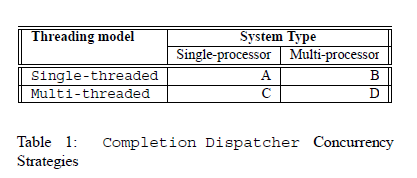

如果您的操作系统仅支持同步I / O，请参考Reactor模式[5]。 但是，大多数现代操作系统都支持某种形式的异步I / O。

在表1中的A和B组合中，假定您不等待任何信号量或互斥量，则异步I / O的后响应方法可能是最好的。 如果您愿意，Call-through实施可能会响应更快。在组合C中，使用直通方法。 在组合D中，使用线程池方法。 在实践中，必须进行系统的经验测量以选择最合适的替代方法。


### 7.3 ==实现完成处理程序==

完成处理程序的实现引起以下问题。

#### 7.3.1 状态完整性

完成处理程序可能需要维护有关特定请求的状态信息。 例如，OS可以通知Web服务器仅文件的一部分被写入了网络通信端口。 结果，完成处理程序可能需要重新发出请求，直到文件被完全写入或连接变为无效为止。因此，它必须知道最初指定的文件，要写入的字节数以及上一个请求开始时文件指针的位置。

没有隐式的限制，可以防止主动启动器将多个异步操作请求分配给单个完成处理程序。结果，完成处理程序必须在整个完成通知链中绑定特定于请求的状态信息。 为此，完成处理程序可以利用异步完成令牌模式[8]。


#### 7.3.2 资源管理

与任何多线程环境一样，Proactor模式也不会减轻完成处理程序的工作量，以确保对共享资源的访问是线程安全的。 但是，完成处理程序不得跨多个完成通知使用共享资源。 如果这样做的话，就有可能引发哲学家就餐问题[11]。

此问题是当逻辑控制线程永远等待信号量发出信号时导致的死锁。 这是通过想象一群哲学家参加的晚宴来说明的。 食客们坐在圆桌旁，每个哲学家之间正好用一根筷子。 哲学家饿了时，必须拿起左右两侧的筷子才能吃饭。 哲学家一旦获得了一根筷子，他们就不会释放它，直到他们的饥饿感得到满足为止。 如果所有哲学家都拿起右侧的印章，则会发生死锁，因为左侧的印章将永远无法使用。


#### 7.3.3 抢占策略

Completion Dispatcher类型确定执行时Completion Handler是否可以抢占。当附加到动态线程和线程池分派器时，完成处理程序自然是先占的。但是，当绑定到后反应完成调度程序时，完成处理程序就彼此而言并不是抢先的。 当由Callthrough调度程序驱动时，完成处理程序对于处于可警告等待状态的控制线程不是抢占式的。

通常，除非使用多个完成线程，否则处理程序不应执行长时间的同步操作，因为这将大大降低应用程序的总体响应速度。 可以通过增加编程纪律来减轻这种风险。 例如，所有完成处理程序都必须充当主动启动器，而不是执行同步操作。


## 8 示例代码

本节介绍如何使用Proactor模式开发Web服务器。 该示例基于ACE框架中的Proactor模式实现[4]。
当客户端连接到Web服务器时，将调用HTTP处理程序的open方法。 然后，服务器会初始化异步I / O对象，并在异步操作完成（在这种情况下指的是this指针），用于传输数据的网络连接以及操作完成后要使用的完成调度程序（proactor）的情况下进行回调 ）。 然后，异步启动读取操作，服务器返回到事件循环。

异步读取操作完成后，调度程序将回调HTTP Handler :: handle_read_stream()。 如果有足够的数据，则将解析客户端请求。 如果整个客户端请求尚未到达，则异步启动另一个读取操作。

响应GET请求，服务器将映射请求的文件并将文件数据异步写入客户端。 写入操作完成后，调度程序将回调HTTP Handler :: handle_write_stream()，这将释放动态分配的资源。

附录包含两个其他代码示例，用于使用同步线程模型和同步（非阻塞）反应模型来实现Web服务器。

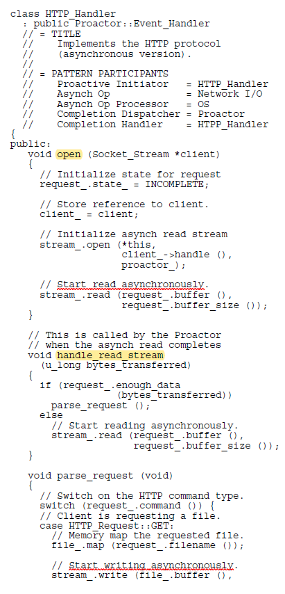

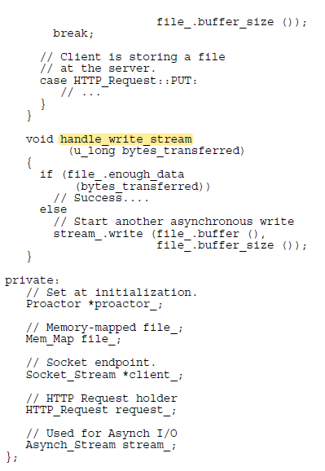


## 9 个人总结

### 9.1 模式框架

按照上面论文的思路，我们可以想象一种Proactor模式下的多线程框架（采用主线程Proactive Initiator+多工作线程池的模式）应该类似于如下的样貌：

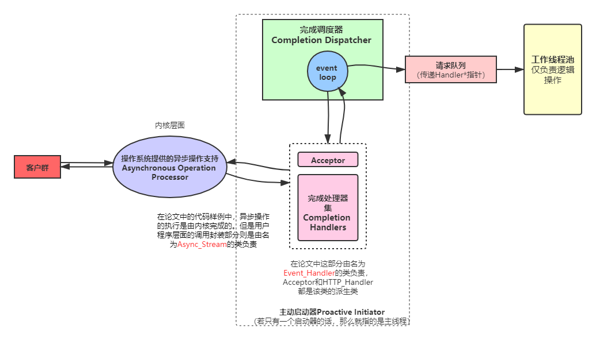

从原理上讲，异步I/O是最贴近计算机硬件层面DMA+中断工作方式的I/O变成模型，但由于在Linux上没有实现真正意义上的异步I/O，所以我们只能通过模拟Proactor的方式来实现Proactor模式。


### 9.2 Proactor和Reactor的区别

Reactor和Proactor两者之间的区别在于，前者的事件循环获取的是准备完成事件，同时事件处理器的责任不仅需要处理逻辑处理、也要连带处理数据的读写。

而后者若是真采用异步I/O模式，则事件循环获取到的是完成事件的通知；但若是通过同步I/O模式进行模拟，那么事件循环获取的是准备事件的通知，但Proactor此时会自动对其执行数据的读写操作。然后再将逻辑处理的任务交给Handler的回调函数去处理（一般在多线程中让工作线程处理），这样的好处在于工作线程进行需要做逻辑处理的操作，而不需要像Reactor那样既处理数据的读写也需要做逻辑处理操作。

因此从广义上来讲最主要的区别在于工作线程的责任是否仅仅处理逻辑操作这一点，更狭义的话就是时事件通知的不同。


### 9.3 以模拟Proactor的方式构建一个简单HTTP Server

模拟Proactor方法的本质从编程的角度上来讲其实仅仅就是Reactor模式的微小变动：让HTTP_Handler在工作线程中不再负责读数据和写数据的任务，而是仅仅负责HTTP报文的解析和逻辑处理。

1、首先需要完成一些基础组件，比如线程池threadpool：

```c++
template<typename Event_Handler>
class threadpool{
public:
    void append(Event_Handler*);
    
private:
    static void * thread_func(void*args);
    /* 每一个工作线程中调用run()方法，试图从请求队列中
    获取一个事件处理器指针Event_Handler*，然后进行处理 */
    void run();
    
private:
	std::queue<Handler*> _M_queue;    
};
```

2、接着，我们应该设计完成调度器Completion Dispatcher：

```c++
class Completion_Dispatcher{
public:
    //使用单例模式保证只有一个完成调度器
    Completioin_Dispatcher* getinstance();
	void register_handler(Event_Handler*);
    void remove_handler(Event_Handler*);
    void events_loop();
    /* ... */
private:
    /* 假设不考虑定时器和MySQL连接池 */
	threadpool<Event_Handler*> _M_threadpool;
   	std::unordered_map<Handle,Event_Handler*> _M_handlers;
};

void Completion_Dispatcher::events_loop(){
    for(;;){
        int nret=epoll_wait(...);
        for(int i=0;i<nret;++i){
            int sockfd=events[i].data.fd;
            
           	if(监听套接字有新的连接事件){
                Acceptor->event_handle();
            }
            else if(连接套接字的对端关闭){
               	关闭套接字;
                remove_handler(http_handler);
            }
            else if(连接套接字读准备事件){
                http_handler->read();
                _M_threadpool.append(http_handler);
            }
            else if(连接套接字写准备事件){
                http_handler->write();
                根据情况是继续保持连接还是直接关闭连接;
            }
            else ;
        }
    }
}
```

3、最后，设计事件处理器继承结构体系：

```c++
class Event_Handler{
public:
    typedef int Handle;   
    virtual void event_handle()=0;
    virtual Handle get_handle()=0;
};

class Acceptor:public Event_Handler{
public:
  	Acceptor(){
        //先创建listenfd，完成bind、listen的过程
        Completion_Dispatcher::getinstance()->register_handler(this);
    }
	void event_handle(){
        int sockfd=accpet(listenfd);
        HTTP_Handler* handler=new HTTP_Handler(sockfd);
    }    
    Handle get_handle(){return listenfd;}

private:
	Handle listenfd;    
};

class AIO_Handler:public Event_Handler{
public:
    AIO_Handler(){
        Completion_Dispatcher::getinstance()->register_handler(this);
    }
    virtual void event_handle()=0;
    Handle get_handle() override{return sockfd;}
    
private:
	int sockfd;  
    char readbuf[];
    char writebuf[];
};

class HTTP_Handler:public AIO_Handler{
public:
	void event_handle(){
        //解析HTTP报文
        //完成逻辑处理任务
    }
}
```