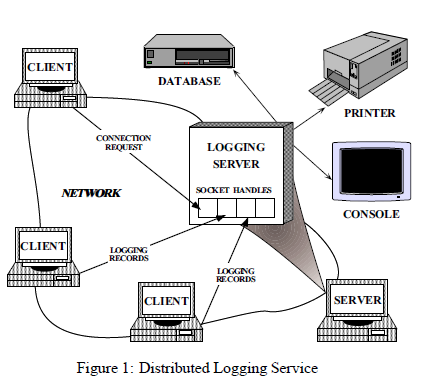
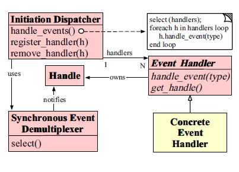
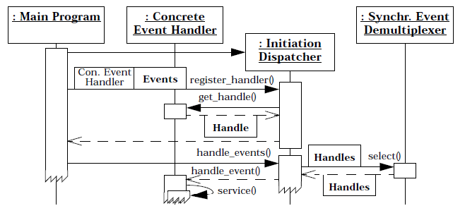
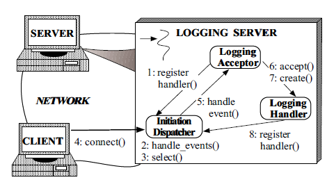
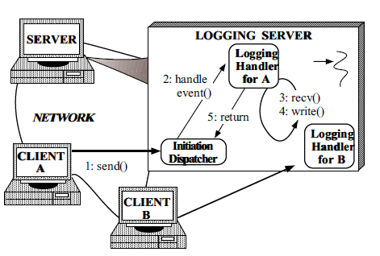
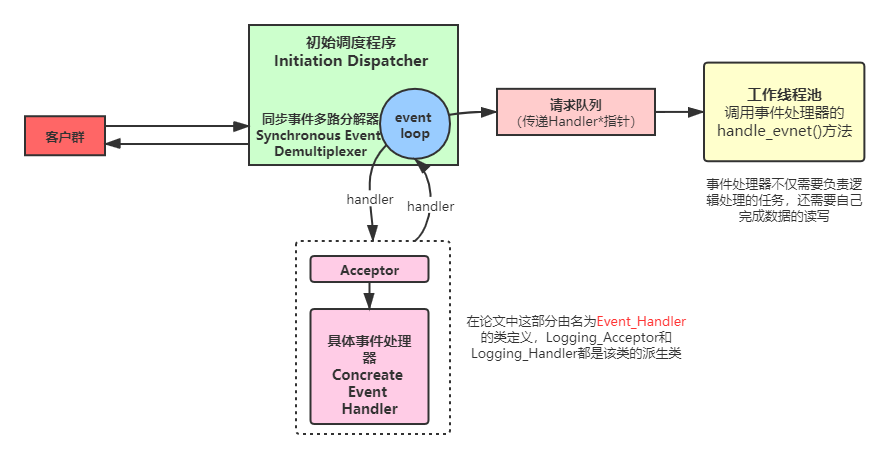

# Reactor：一种面向同步事件的多路分解和处理器调度的对象行为模式

## 1 意图

Reactor设计模式处理由一个或多个客户端同时交付给应用程序的服务请求。 应用程序中的每个服务都可以由服务器方法组成，并由负责分派特定于服务的请求的单独事件处理程序表示。事件处理程序的调度由初始化调度程序执行，该调度程序管理已注册的事件处理程序。服务请求的多路分解由同步事件多路分解器执行。

## 2 别名

调度程序，通知程序

## 3 示例

为了说明Reactor模式，请考虑图1所示的事件驱动服务器，用于分布式日志记录服务。客户端应用程序使用日志记录服务来记录有关它们在分布式环境中的状态的信息。 此状态信息通常包括错误通知，调试跟踪和性能报告。 日志记录被发送到中央日志服务器，该服务器可以将记录写入各种输出设备，例如控制台，打印机，文件或网络管理数据库。

图1中所示的日志服务器处理客户端发送的日志记录和连接请求。 记录记录和连接请求可以同时到达多个句柄。 句柄标识OS内管理的网络通信资源。

日志记录服务器使用面向连接的协议（例如TCP [1]）与客户端进行通信。 想要记录数据的客户端必须首先向服务器发送连接请求。 服务器使用句柄工厂等待这些连接请求，该工厂监听客户端已知的地址。当连接请求到达时，句柄工厂通过创建代表连接端点的新句柄在客户端和服务器之间建立连接。该句柄返回到服务器，然后服务器等待客户端服务请求到达该句柄。 客户端连接后，他们可以将日志记录同时发送到服务器。 服务器通过连接的套接字句柄接收这些记录。

开发并发日志服务器的最直观的方法也许是使用可以同时处理多个客户端的多个线程，如图2所示。此方法同步接受网络连接并生成“每个连接线程”以处理客户端日志记录 。但是，使用多线程在服务器中实现日志记录的处理无法解决以下问题：

**效率**：线程可能由于上下文切换，同步和数据移动而导致性能不佳[2]；

**简化编程**：线程可能需要复杂的并发控制方案；

**可移植性**：线程并非在所有OS平台上都可用。
由于这些缺点，多线程通常不是开发并发日志服务器的最有效或最不复杂的解决方案。

## 4 上下文

分布式系统中的服务器应用程序，可以同时从一个或多个客户端接收事件。

## 5 问题

分布式系统中的Server应用程序必须处理向其发送服务请求的多个客户端。 但是，在调用特定服务之前，服务器应用程序必须多路分解并将每个传入请求分派到其相应的服务提供者。 开发一种有效的服务器机制以多路分解和分发客户端请求，需要解决以下问题：

**可用性**：服务器必须可用于处理传入的请求，即使它正在等待其他请求到达也是如此。特别是，服务器不得在排除其他事件源的情况下无限期地阻止处理任何单个事件源，因为这可能会大大延迟对其他客户端的响应。

**效率**：服务器必须最小化延迟，最大化吞吐量并避免不必要地利用CPU。

**简化编程**：服务器的设计应简化适当的并发策略的使用。 

**适应性**：集成新的或改进的服务，例如更改消息格式或添加服务器端缓存，应为现有代码带来最少的修改和维护成本。 例如，实现新的应用程序服务不应要求修改通用事件多路分解和调度机制。

**可移植性**：将服务器移植到新的OS平台上不需要花费很多精力。

## 6 解决方案

集成了事件的同步多路分解和处理事件的相应事件处理程序的分派。 另外，将服务的特定于应用的调度和实现与通用事件多路分解和调度机制分离开。

对于应用程序提供的每种服务，请引入一个单独的事件处理程序来处理某些类型的事件。 所有事件处理程序都实现相同的接口。事件处理程序向启动分派器注册，该分派器使用同步事件多路分解器等待事件发生。 当事件发生时，同步事件多路分解器通知启动调度程序，该调度程序同步地回调与该事件关联的事件处理程序。 然后，事件处理程序将事件分派给实现所请求服务的方法。

## 7 结构

Reactor模式的主要参与者包括：

**句柄Handles**

- 标识由OS管理的资源。这些资源通常包括网络连接，打开文件，计时器，同步对象等。在日志记录服务器中使用句柄来标识套接字端点，以便同步事件多路分解器可以等待事件在它们上发生。 日志记录服务器感兴趣的两种类型的事件是连接事件和读取事件，它们分别表示传入的客户端连接和日志记录数据。 日志记录服务器为每个客户端维护一个单独的连接。 服务器中的每个连接都由套接字句柄表示。

**同步事件多路分解器Synchronous Event Demultiplexer**

- 阻止等待事件发生在一组句柄上。当可以在句柄上启动操作而不会阻塞时，它将返回。select [1]是用于I / O事件的常见多路分解器，它是UNIX和Win32 OS平台提供的事件多路分解系统调用。  select调用指示哪些Handle可以同步调用其上的操作，而不会阻塞应用程序进程。

**初始调度程序Initiation Dispatcher**

- 定义用于注册，删除和调度事件处理程序的接口。 最终，同步事件多路分解器负责等待新事件发生。 当检测到新事件时，它通知Initiation Dispatcher回调特定于应用程序的事件处理程序。 常见事件包括连接接受事件，数据输入和输出事件以及超时事件。

**事件处理程序Event Handler**

- 指定一个接口，该接口由钩子方法[3]组成，该方法抽象地表示特定于服务的事件的调度操作。 此方法必须由特定于应用程序的服务来实现。

**具体事件处理程序Concrete Event Handler**

- 实现挂钩方法，以及以特定于应用程序的方式处理这些事件的方法。 应用程序向启动分派器注册具体事件处理程序，以处理某些类型的事件。 当这些事件到达时，Initiation Dispatcher会回调适当的Concrete Event Handler的hook方法。

    日志服务器中有两个具体事件处理程序：日志处理程序和日志接受器。 日志处理程序负责接收和处理日志记录。 日志接受器创建并连接日志处理程序，该处理程序处理来自客户端的后续日志记录。

下面的OMT类图说明了Reactor模式参与者的结构：

## 8 动态过程

### 8.1 常规协作

在Reactor模式中发生以下协作：

- 当应用程序向Initiation Dispatcher注册了具体事件处理程序时，应用程序将指示事件的类型，该事件处理程序希望Initiation Dispatcher在事件发生时通知它 （s）出现在关联的句柄上。
- 初始化调度程序请求每个事件处理程序传回其内部句柄。该句柄向OS标识事件处理程序。
- 注册所有事件处理程序后，应用程序将调用处理事件以启动Initiation Dispatcher的事件循环。 此时，启动分派器将来自每个已注册事件处理程序的句柄进行组合，并使用同步事件多路分解器等待事件在这些句柄上发生。 例如，TCP协议层使用选择同步事件多路分解操作来等待客户端日志记录事件到达连接的套接字句柄。
- 当对应于事件源的句柄变为“就绪”（例如，TCP套接字已“就绪以供读取”）时，同步事件多路分解器会通知启动调度程序。
- Initiation Dispatcher响应事件处理程序上的事件触发事件处理程序挂钩方法。 当事件发生时，Initiation Dispatcher将事件源激活的Handle作为“键”来定位和调度适当的Event Handler的hook方法。
- Initiation Dispatcher回调事件处理程序的handle事件挂钩方法，以响应于事件执行特定于应用程序的功能。 发生的事件类型可以作为参数传递给该方法，并由该方法在内部使用以执行其他特定于服务的多路分解和调度。 可选的调度方法在第9.4节中介绍。

以下交互图说明了应用程序代码与Reactor模式中的参与者之间的协作：

### 8.2 协作方案

可以用两种方案来说明在Reactor模式下用于日志记录服务器的协作。 这些方案说明了使用反应式事件分派设计的日志记录服务器如何处理连接请求和来自多个客户端的数据记录。

#### 8.2.1 客户端连接到反应式日志服务器

第一种情况显示了客户端连接到日志服务器时所采取的步骤。

该步骤序列可以概括如下：

1. 日志记录服务器（1）向启动分派器注册日志记录接受器以处理连接请求；
2. 日志记录服务器调用Initiation Dispatcher的handle事件方法（2）；
3. Initiation Dispatcher调用同步事件多路分解选择（3）操作，以等待连接请求或日志数据到达；  
4. 客户端将（4）连接到日志服务器；
5. 初始分配器（5）将新的连接请求通知日志接受器；
6. 日志接受器接受（6）新连接；
7. 日志接受器创建（7）日志处理程序以服务新客户端；
8. Logging Handler将其套接字句柄注册（8）到Initiation Dispatcher，并指示分配器在套接字变为“准备读取”时通知它。

#### 8.2.2 客户端将日志记录发送到反应式日志服务器

第二种情况显示了反应式日志服务器为日志记录服务提供服务的步骤顺序。 

该步骤序列可以总结如下：

1. 客户端发送（1）日志记录；
2. 当客户机日志记录由OS在其套接字句柄上排队时，Initiation Dispatcher通知（2）关联的日志记录处理程序；
3. 以非阻塞方式接收记录（3）（重复步骤2和3，直到完全接收到日志记录为止）；
4. 日志处理程序处理日志记录，并将其写入（4）到标准输出中。
5. 记录处理程序将（5）控制权返回到初始调度程序的事件循环。

## 9 实现

本节介绍如何在C ++中实现Reactor模式。 下面描述的实现受ACE通信软件框架[2]中提供的可重用组件的影响。  

### 9.1 选择同步事件多路分解器机制

Initiation Dispatcher使用同步事件多路分解器来同步等待，直到发生一个或多个事件。 通常使用OS事件多路分解系统调用（如select）来实现。select调用指示哪些Handle已准备好执行I / O操作，而不会阻塞特定于应用程序的服务处理程序所在的OS进程。 通常，同步事件多路分解器基于现有OS机制，而不是由Reactor模式的实现者开发。  

### 9.2 ==开发一个Initiation Dispatcher==

以下是开发Initiation Dispatcher所必需的步骤：

**实现事件处理程序表**：Initiation Dispatcher维护一个具体事件处理程序表。 因此，Initiation Dispatcher提供了在运行时注册和从此表中删除处理程序的方法。 如果将句柄表示为小整数值的连续范围，则可以以各种方式来实现该表，例如，使用哈希，线性搜索或直接索引。

**实现事件循环入口点**：到Initiation Dispatcher的事件循环的入口点应该由handle事件方法提供。 此方法控制同步事件多路分解器提供的Handle多路分解，以及执行事件处理程序调度。 通常，整个应用程序的主事件循环都由该入口点控制。

当事件发生时，Initiation Dispatcher从同步事件多路分解调用返回，并通过为“就绪”的每个句柄调度事件处理程序的handle事件挂钩方法来“做出反应”。 该挂钩方法执行用户定义的代码，并在完成时将控制权返回给“初始化分派器”。

以下C ++类说明了Initiation Dispatcher的公共接口上的核心方法：

**实现必要的同步机制**：如果在仅具有一个控制线程的应用程序中使用Reactor模式，则可以消除所有同步。在这种情况下，Initiation Dispatcher会在应用程序的进程中序列化事件处理程序句柄事件挂钩。

但是，启动分派器还可以在多线程应用程序中充当中央事件分派器。在这种情况下，必须对Initiation Dispatcher中的关键部分进行序列化，以防止在修改或激活共享状态变量（例如保存事件处理程序的表）时出现竞态条件。 防止竞态条件的常用技术是使用互斥机制，如信号量或互斥量变量。

为了防止自锁，互斥机制可以使用递归锁[4]。 当通过Initiation Dispatcher中的事件处理程序挂钩方法中的同一线程持有锁时，递归锁保持可防止死锁。 拥有锁的线程可以重新获取递归锁，而不会阻塞该线程。 此属性很重要，因为Reactor的handle events方法会回调特定于应用程序的Event Handlers。 应用程序挂钩方法代码随后可以通过其注册处理程序重新输入启动分派器，并删除处理程序方法。

### 9.3 确定调度目标的类型

可以将两种不同类型的事件处理程序与一个句柄相关联，以用作启动调度程序的调度逻辑的目标。  Reactor模式的实现可以选择以下两种调度方法中的一种或两种：

**事件处理程序对象**：将事件处理程序与Handle关联的一种常用方法是使事件处理程序成为对象。 例如，第7节中显示的Reactor模式实现将事件处理程序子类对象注册到一个Initiation Dispatcher。使用对象作为调度目标可以方便地对事件处理程序进行子类化，以便重用和扩展现有组件。 另外，对象将服务的状态和方法集成到单个组件中。

**事件处理程序函数**：将事件处理程序与Handle关联的另一种方法是向Initiation Dispatcher注册一个函数。 使用函数作为调度目标可以方便地注册回调，而不必定义从事件处理程序继承的新类。

适配器模式[5]用于同时支持对象和功能。 例如，可以使用事件处理程序对象定义适配器，该对象持有指向事件处理程序功能的指针。 当在事件处理程序适配器对象上调用handle事件方法时，它可以自动将调用转发到它拥有的事件处理程序函数。

### 9.4 ==定义事件处理接口==

假设我们使用事件处理程序对象而不是函数，下一步是定义事件处理程序的接口。 有两种方法：

**单方法接口**：第7节中的OMT图说明了事件处理程序基类接口的实现，该接口包含一个称为处理事件的单一方法，Initiation Dispatcher使用该方法来调度事件。 在这种情况下，已发生事件的类型将作为参数传递给方法。以下C ++抽象基类说明了单方法接口：

单方法接口的优点是可以在不更改接口的情况下添加新类型的事件。但是，这种方法鼓励在子类的handle事件方法中使用switch语句，这限制了它的可扩展性。

**多方法接口**：实现事件处理程序接口的另一种方法是为每种事件类型（例如句柄输入，句柄输出或句柄超时）定义单独的虚拟挂钩方法。以下C ++抽象基类说明了单方法接口：

多方法接口的好处是很容易在基类中有选择地重写方法，并避免在钩子方法中进一步进行多路分解，例如通过switch或if语句。 但是，它要求框架开发人员预先预期事件处理程序方法的集合。 例如，上面的事件处理程序接口中的各种handle *方法是为通过UNIX选择机制提供的I / O事件而量身定制的。 但是，该接口不够广泛，无法涵盖通过Win32 WaitForMultipleObjects机制处理的所有事件类型[6]。

上述两种方法都是[3]中描述的挂钩方法模式和[7]中描述的Factory Callback模式的示例。 这些模式的目的是提供定义明确的钩子，这些钩子可以由应用程序专门化，并可以由较低级别的调度代码进行回调。

### 9.5 确定应用程序中的启动调度程序的数量

可以仅使用Reactor模式的一个实例来构造许多应用程序。 在这种情况下，可以将Initiation Dispatcher实现为Singleton [5]。 此设计对于将事件多路分解和分发集中到应用程序中的单个位置很有用。

但是，某些操作系统限制了在单个控制线程中可以等待的句柄数。 例如，Win32允许select和WaitForMultipleObjects在单个线程中等待不超过64个句柄。 在这种情况下，可能有必要创建多个线程，每个线程运行自己的Reactor模式实例。

请注意，事件处理程序仅在Reactor模式的实例内序列化。 因此，多个线程中的多个事件处理程序可以并行运行。如果不同线程中的事件处理程序访问共享状态，则此配置可能需要使用其他同步机制。

### 9.6 ==实现具体事件处理程序==

具体事件处理程序通常由应用程序开发人员创建，以响应于特定事件而执行特定服务。 当启动调度程序调用相应的hook方法时，开发人员必须确定要执行什么处理。

以下代码为第3节中描述的日志记录服务器实现了具体事件处理程序。这些处理程序提供被动连接建立（日志记录接受器）和数据接收（日志记录处理程序）。

**Logging Acceptor类**：此类是Acceptor-Connector模式[8]的Acceptor组件的示例。  Acceptor-Connector模式将服务初始化的任务与服务初始化之后执行的任务分离。 此模式使服务的特定于应用程序的部分（例如日志记录处理程序）能够独立于用于建立连接的机制而变化。

日志接受器被动地接受来自客户端应用程序的连接，并创建特定于客户端的日志记录处理程序对象，该对象接收并处理来自客户端的日志记录。 下面定义了Logging Acceptor类中的关键方法和数据成员：

Logging Acceptor类继承自Event Handler基类。 这使应用程序可以向启动分派器注册日志记录接受器。

Logging Acceptor还包含SOCK Acceptor器的实例。 这是一个具体工厂，使Logging Acceptor可以在侦听通信端口的被动模式套接字上接受连接请求。 当连接从客户端到达时，SOCK接受器接受连接并生成SOCK流对象。 此后，SOCK Stream对象用于在客户端和日志记录服务器之间可靠地传输数据。

用于实现日志记录服务器的SOCK Acceptor和SOCK Stream类是ACE [9]提供的C ++套接字包装库的一部分。 这些套接字包装器将套接字接口的SOCK流语义封装在可移植且类型安全的面向对象的接口内。
在Internet域中，SOCK Stream套接字是使用TCP实现的。

Logging Acceptor的构造函数向ACCEPT事件的Initiation Dispatcher Singleton [5]注册自己，如下所示：

此后，每当客户端连接到达时，Initiation Dispatcher便会调用Logging Acceptor的handle_event方法，如下所示：

handle_event方法调用SOCK接受器的accept方法来被动地建立SOCK流。 将SOCK流与新客户端连接后，将动态分配日志记录处理程序以处理日志记录请求。 如下所示，日志记录处理程序将自己注册到启动分派器，该分派器将多路复用与其关联的客户端的所有日志记录。

**Logging Handler类**：日志服务器使用下面显示的Logging Handler类来接收客户端应用程序发送的日志记录：

日志处理程序是从事件处理程序继承的，它使它可以在启动分配器中注册，如下所示：

创建日志后，日志处理程序就会向Initiation Dispatcher Singleton注册以进行READ事件。 此后，当日志记录到达时，Initiation Dispatcher会自动调度关联的Logging Handler的handle事件方法，如下所示：

当套接字句柄上发生READ事件时，初始化调度程序将回调日志记录处理程序的handle事件方法。此方法接收，处理日志记录并将其写入标准输出（STDOUT）。 同样，当客户端关闭连接时，Initiation Dispatcher将传递CLOSE事件，该事件通知Logging Handler关闭其SOCK流并删除自身。

### 9.7实现服务器

日志记录服务器包含一个主要功能。

**日志记录服务器主函数**：此函数实现了一个单线程并发日志记录服务器，该服务器在Initiation Dispatcher的handle events事件循环中等待。 当请求从客户端到达时，Initiation Dispatcher会调用适当的Concrete Event Handler挂钩方法，该方法接受连接并接收和处理日志记录。进入日志服务器的主要入口点定义如下：

主程序创建一个Logging Acceptor，其构造函数使用日志服务器的端口号对其进行初始化。 然后，程序进入其主事件循环。随后，Initiation Dispatcher Singleton使用选择事件多路分解系统调用来同步等待连接请求和日志记录从客户端到达。

以下交互图说明了参与日志记录服务器示例的对象之间的协作：

一旦初始化了Initiation Dispatcher对象，它便成为日志服务器中控制流的主要焦点。 所有后续活动都由在Initiation Dispatcher中注册并受其控制的Logging Acceptor和Logging Handler对象上的钩子方法触发。

当连接请求到达网络连接时，启动调度程序将回调日志接受器，该接受器接受网络连接并创建日志处理程序。 然后，此日志记录处理程序向启动分派器注册READ事件。 因此，当客户端发送日志记录时，Initiation Dispatcher会回调客户端的Logging Handler，以在日志服务器的单控制线程中处理来自该客户端连接的传入记录。

## 10 结果

### 10.1 好处

Reactor模式具有以下好处：

**关注点分离**：Reactor模式将与应用程序无关的解复用和调度机制与特定于应用程序的挂钩方法功能分离。 与应用程序无关的机制成为可重用的组件，这些组件知道如何对事件进行多路分解并分派由事件处理程序定义的相应挂钩方法。 相反，挂钩方法中的特定于应用程序的功能知道如何执行特定类型的服务。

**改善事件驱动的应用程序的模块化，可重用性和可配置性**：该模式将应用程序功能分离为单独的类。 例如，日志服务器中有两个单独的类：一个用于建立连接，另一个用于接收和处理日志记录。 通过这种解耦，可以将连接建立类重用于不同类型的面向连接的服务（例如文件传输，远程登录和视频点播）。 因此，修改或扩展日志服务器的功能只会影响日志处理程序类的实现。

**提高应用程序的可移植性**：可以独立于执行事件多路分解的OS系统调用来重用Initiation Dispatcher的界面。这些系统调用检测并报告可能在多个事件源上同时发生的一个或多个事件的发生。 常见的事件源可能包括I / O句柄，计时器和同步对象。 在UNIX平台上，事件多路分解系统调用称为select and poll [1]。 在Win32 API [16]中，WaitForMultipleObjects系统调用执行事件多路分解。

**提供粗粒度的并发控制**：Reactor模式在流程或线程内的事件多路分解和分派级别上序列化事件处理程序的调用。 在Initiation Dispatcher级别进行序列化通常不需要在应用程序进程中进行更复杂的同步或锁定。  

### 10.2 责任

Reactor模式具有以下责任：

**有限的适用性**：只有在OS支持Handles的情况下，才能有效地应用Reactor模式。 可以使用Initiation Dispatcher中的多个线程来模拟Reactor模式的语义，例如 每个句柄一个线程。 每当句柄上有可用事件时，其关联线程将读取该事件并将其放置在由初始化调度程序顺序处理的队列上。 但是，这种设计通常效率很低，因为它会序列化所有事件处理程序，从而在不增强并行性的情况下增加了同步和上下文切换开销。

**非抢占式**：在单线程应用程序进程中，事件处理程序在执行时不会被抢占。 这意味着事件处理程序不应在单个Handle上执行阻塞I / O，因为这将阻塞整个过程并阻碍对连接到其他Handle的客户端的响应。 因此，对于长时间的操作，例如传输数兆字节的医学图像[15]，活动对象模式[17]可能更有效。 活动对象使用多线程或多处理来与Initiation Dispatcher的主事件循环并行完成任务。

**难以调试**：用Reactor模式编写的应用程序可能很难调试，因为控制反转的过程在框架基础结构和特定于应用程序的处理程序的方法回调之间振荡。 由于应用程序开发人员可能不了解或无法访问框架代码，因此这增加了在调试器中通过框架的运行时行为“单步执行”的难度。 这类似于尝试调试用LEX和YACC编写的编译器词法分析器和解析器时遇到的问题。 在这些应用程序中，当控制线程位于用户定义的动作例程中时，调试非常简单。 但是，一旦控制线程返回到生成的确定性有限自动机（DFA）骨架，就很难遵循程序逻辑。

## 11 模式架构

下面展示了采用reactor模式下一个Initiation Dispatcher+工作线程池所形成的服务器架构：

**在Reactor中实现读：**

- 注册读就绪事件和相应的事件处理器。
- 事件分发器等待事件。
- 事件到来，激活分发器，分发器调用事件对应的处理器。
- 事件处理器完成实际的读操作，处理读到的数据，注册新的事件，然后返还控制权。

**在Proactor中实现读：**

- 处理器发起异步读操作（注意：操作系统必须支持异步IO）。在这种情况下，处理器无视IO就绪事件，它关注的是完成事件。
- 事件分发器等待操作完成事件。
- 在分发器等待过程中，操作系统利用并行的内核线程执行实际的读操作，并将结果数据存入用户自定义缓冲区，最后通知事件分发器读操作完成。
- 事件分发器呼唤处理器。
- 事件处理器处理用户自定义缓冲区中的数据，然后启动一个新的异步操作，并将控制权返回事件分发器。

可以看出，两个模式的相同点，都是对某个I/O事件的事件通知（即告诉某个模块，这个I/O操作可以进行或已经完成)。在结构上，两者也有相同点：事件分发器负责提交IO操作（异步)、查询设备是否可操作（同步)，然后当条件满足时，就回调handler；不同点在于，异步情况下（Proactor)，当回调handler时，表示I/O操作已经完成；同步情况下（Reactor)，回调handler时，表示I/O设备可以进行某个操作（can read 或 can write)。